# G29_Grafos_PA-26.1

Número da lista: 26
Conteúdo da disciplina: Ordenação Topológica

## Alunos 
| Nome | Matrícula |
|------|-----------|
| Alan Farias Braga | 251005909 |
| Vilmar José Fagundes | 231026590 |

## Sobre
Esse projeto implementa um Gerenciador de Projetos e Tarefas baseado em Teoria dos Grafos, onde cada tarefa é um vértice e cada dependência (pré-requisito) é uma aresta direcionada.

A lógica do sistema está na função de gerar o fluxograma, que utiliza o Algoritmo de Kahn para realizar uma ordenação topológica. Garantindo rigorosamente que uma tarefa só apareça na linha do tempo após todos os seus pré-requisitos terem sido satisfeitos. O Algoritmo de Kahn resolve esse quebra-cabeça calculando o "grau de entrada" de cada atividade, que nada mais é do que o número de dependências que a bloqueiam. As tarefas que não possuem pré-requisitos, ou seja, com grau zero, são inseridas em uma fila de prontidão.

Conforme o sistema processa essa fila, ele retira as tarefas prontas e simula a conclusão delas, reduzindo o grau de entrada de todas as tarefas subsequentes que dependiam delas. Quando uma dessas tarefas dependentes finalmente tem seu grau reduzido a zero, ela é considerada desbloqueada e entra na fila para a próxima etapa. Esse ciclo continua até que o projeto inteiro seja organizado em níveis de execução simultânea. Caso o algoritmo termine de processar a fila, mas ainda existam tarefas pendentes no sistema, ele detecta automaticamente que há um ciclo lógico insolúvel no projeto, como duas tarefas que dependem uma da outra, e alerta o usuário. Para prevenir que esses ciclos sequer sejam formados durante a fase de planejamento, o programa também utiliza algoritmos de busca preventivos a cada nova dependência cadastrada, garantindo a integridade e a viabilidade do cronograma gerado.

## Screenshot

A imagem a seguir representa o menu inicial exibido no terminal, o qual pode selecionar qual opção deseja executar

**Imagem 1: Tela inicial**

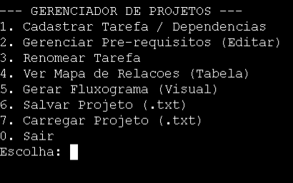

Foram executados testes manuais com o sistema. A seguir, são apresentadas as capturas de tela relacionadas à execução dos testes 

### Teste 1: Adicionar Tarefa Simples
**Passos:**
1. Menu → Opção 1
2. Nome: "Estudar"
3. Possui pré-requisitos? (s/n): n

**Resultado Obtido**:

Figura 2: Criando a tarefa 

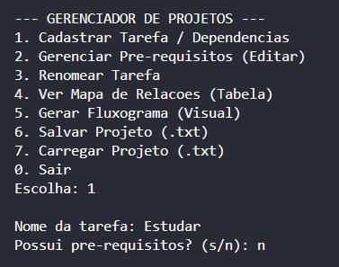

Figura 3: Mapa das tarefas

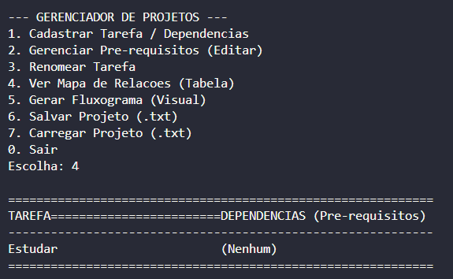

Figura 4: Fluxo das tarefas

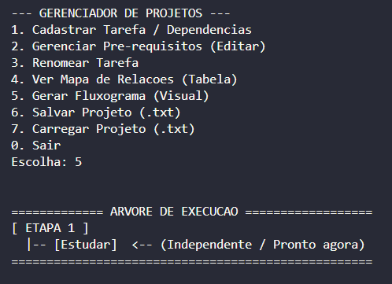

---

### Teste 2: Adicionar Dependência Simples
**Passos:**
1. Menu → Opção 1
2. Nome: "Implementar"
3. Possui pré-requisitos? (s/n): s
4. Nome do pré-requisito: "Estudar"
5. Adicionar outro? (s/n): n

**Resultado obtido:** 

Figura 5: Criando a dependência 

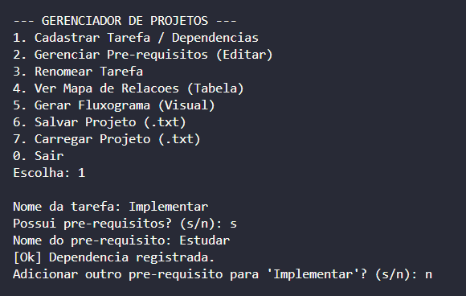

Figura 6: Mapa das tarefas

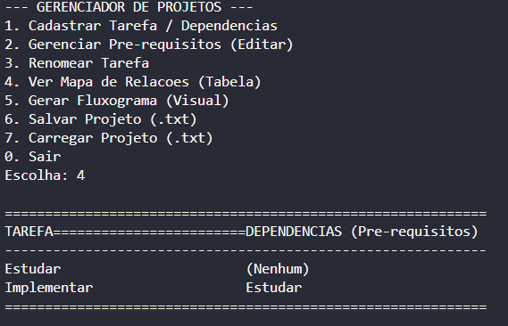

Figura 7: Fluxo das tarefas

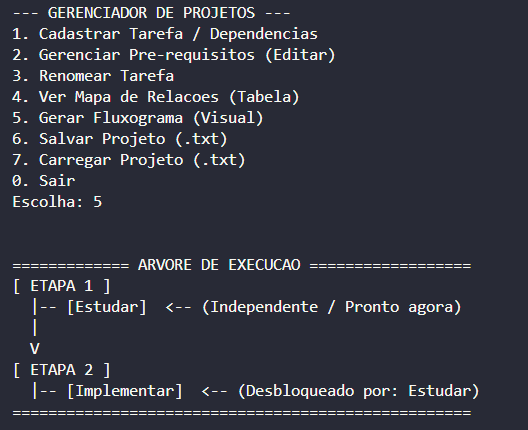

---

### Teste 3: Detecção de Ciclo
**Passos:**
1. Menu → Opção 1
2. Nome: "A"
3. Sem pré-requisitos
4. Menu → Opção 1
5. Nome: "B"
6. Pré-requisito: "A"
7. Menu → Opção 1
8. Nome: "C"
9. Pré-requisito: "B"
10. Menu → Opção 1
11. Nome: "D"
12. Pré-requisito: "C"
13. Menu → Opção 2 → Tarefa: "A"
14. Opção: 1 (Adicionar) → Pré-requisito: "D"

**Resultado obtido:**

Figura 8: Criação do ciclo

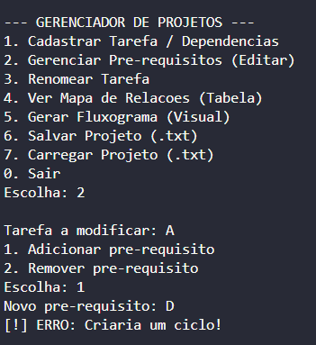

Figura 9: Fluxo das tarefas

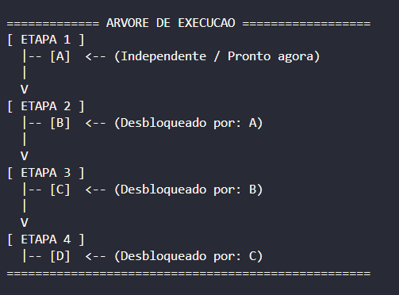

---

### Teste 4: Remover Pré-requisito
**Passos:**
1. Menu → Opção 2
2. Tarefa a modificar: "C"
3. Escolha: 2 (Remover)
4. Pré-requisito a remover: "B"

Figura 10: Remoção da dependência 

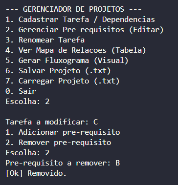

Figura 11: Fluxo após remoção

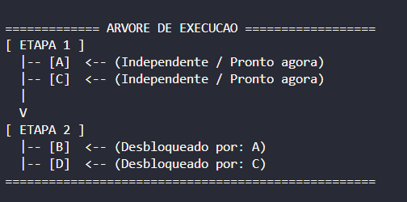

---

### Teste 5: Adicionar Múltiplas Dependências
**Passos:**
1. Menu → Opção 1
2. Nome: "Projeto Final"
3. Possui pré-requisitos? (s/n): s
4. Pré-requisito 1: "Implementar"
5. Adicionar outro? (s/n): s
6. Pré-requisito 2: "Testar"
7. Adicionar outro? (s/n): n

**Resultado obtido:** 

Figura 12: Cadastro das dependências

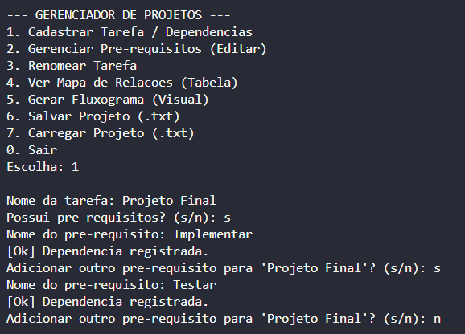

Figura 13: Mapa das tarefas

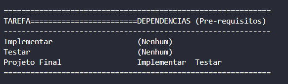

Figura 14: Fluxo das tarefas

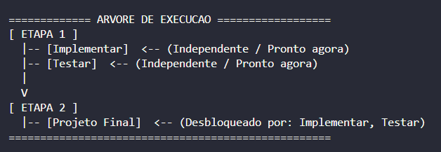

---

### Teste 6: Fluxograma com Tarefas Paralelas
**Passos:**
1. Menu → Opção 1: "Requisitos"
2. Menu → Opção 1: "Design" (sem pré-req)
3. Menu → Opção 1: "Implementação"
   - Pré-req 1: "Requisitos"
   - Pré-req 2: "Design"
4. Menu → Opção 1: "Testes"
   - Pré-req: "Implementação"
5. Menu → Opção 5

**Resultado Obtido:**

Figura 15: Fluxo das tarefas

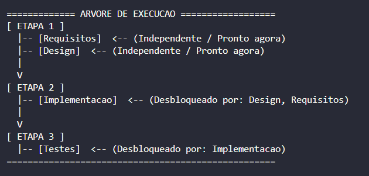

## Instalação 
**Linguagem C++**

## Gravação
A gravação pode ser acessada através do link [https://youtu.be/EVYMweZ4Xec](https://youtu.be/EVYMweZ4Xec)
